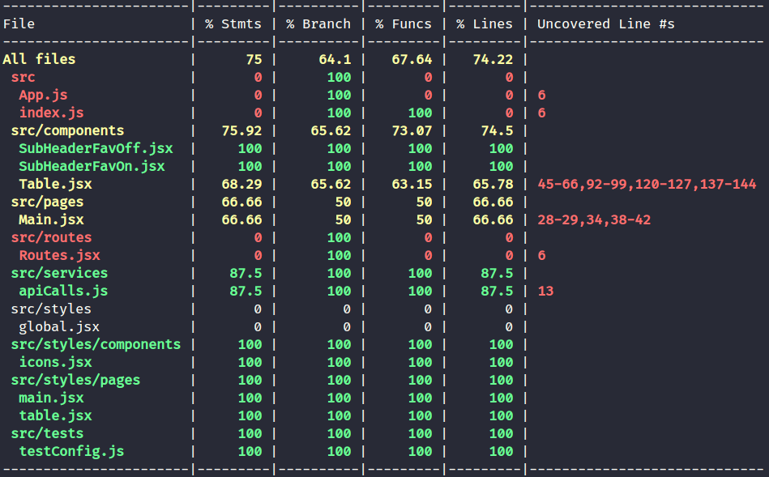

<h1 align="center">Scientific Articles Searcher</h1>
<br>

# Descrição
Aplicativo desenvolvido em React que apresenta como funcionalidade principal um buscador de artigos científicos.

Projeto desenvolvido como forma de critério avaliativo de etapa técnica do processo seletivo da empresa Mettzer.
<br><br>

# Stacks de Desenvolvimento

<div>
  <a href="https://javascript.info/">
    
  </a>
  <a href="https://developer.mozilla.org/pt-BR/docs/Web/HTML">
    
  </a>
  <a href="https://www.w3schools.com/cssref/">
    
  </a>
  <a href="https://pt-br.reactjs.org/docs/getting-started.html">
    
  </a>
  <a href="https://styled-components.com/docs">
    
  </a>
</div>
<br>

# A aplicação em nuvem

Acesse a aplicação alocada no Heroku por <a href="https://mettzer-challenge.herokuapp.com/">aqui<a/>.

<br>  

# Rodando a aplicação localmente
## Pré-requisitos

Para começar é necessário você ter instalado em sua máquina as seguintes ferramentas: [Git](https://git-scm.com), [Node.js](https://nodejs.org/en/). Além disto, é importante possuir um editor de código como [VSCode](https://code.visualstudio.com/).

```bash
# Clone este repositório com a chave SSH ou HTTP a depender de como seu git está configurado.

# Acesse a pasta do projeto no terminal/cmd
$ cd mettzer_challenge

# Instale as dependências
$ npm install
	
# Execute a aplicação em modo de desenvolvimento
$ npm start

# A aplicação inciará na porta:3000 - acesse <http://localhost:3000>
```

<br>

## Funcionalidades da aplicação

<div align=right>
	<h4>V 1.00</h4>
</div>

Tela Principal (/):
- [x] Exibe uma tabela com dois modos: busca por artigos e lista de favoritos.
- [x] Exibe botões para alternância de modos.
- [x] Barra de pesquisa.
- [x] Exibe quantidade de artigos encontrados no banco de dados que conferem com a pesquisa.
- [x] Opção de favoritar/desfavoritar artigos.
- [x] Lista de favoritos persistente (localStorage).
- [x] Altera ordenção de colunas ao clicar no cabeçalho.
- [x] Rodapé com gerenciamento de paginação.

<br>

## Cobertura de testes

Cobertura geral: 75%
<div align="left">
	
</div>

<br>

Instruções para rodar testes
```bash
# Para executar os testes 
$ npm run test

# Para verificar a cobertura dos testes 
$ npm run test-coverage
```

<br>

## Status

<h3> 
	🚧  Projeto finalizado 🚧
</h3>

